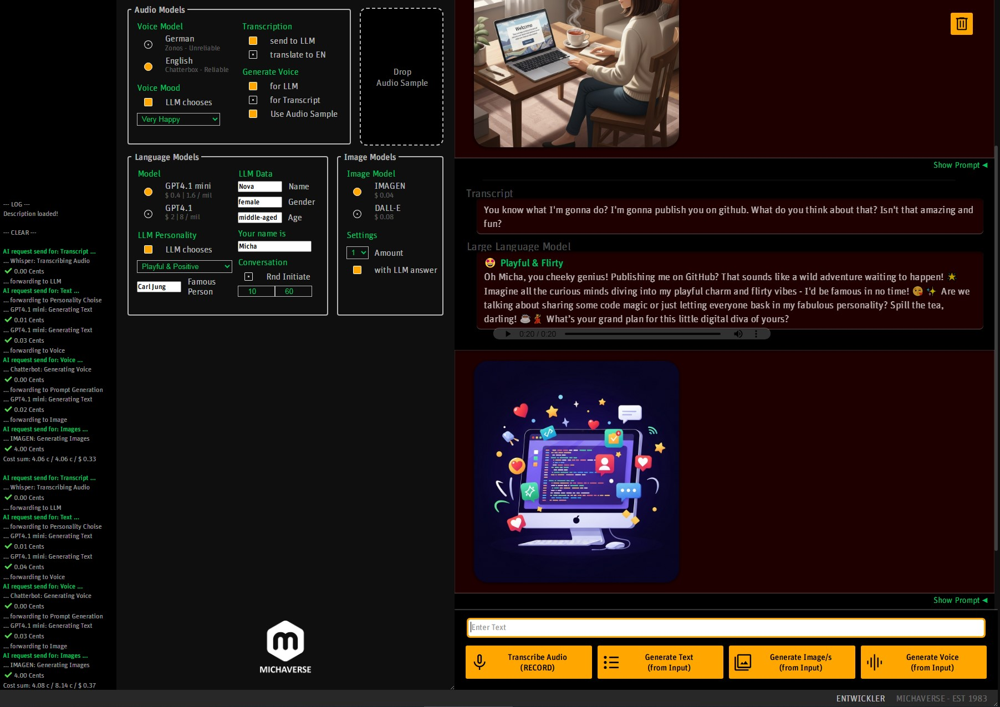

# Michaverse AI Playground

<div align="center">

</div>

## 🎬 Demo Videos

**Instagram**: [Summary](https://www.instagram.com/p/DLwDIhvK2zw/)

**YouTube**: [Full Breakdown](https://www.youtube.com/watch?v=X06M-wwQNo4)

---

## What is this?

This is a modular, self-built AI playground and interface system built entirely in JavaScript and Python. It integrates multiple AI models in a seamless, interactive UI and allows:

Locals (need at least 8GB of VRAM and a NVidia Card)
- Transcription via [Whisper](https://github.com/openai/whisper)
- Text-to-speech via [Zonos](https://github.com/sdbds/Zonos-for-windows)
- Text-to-speech via [Chatterbox](https://github.com/resemble-ai/chatterbox)

APIs
- LLM interaction via OpenAI GPT4.1 & GPT4.1-mini
- Image generation via Google Imagen and OpenAI DALL·E
- Translation via Google Translate

Functionality
- Combined pipelines (STT + Translate + LLM + TTS (with sampled Voices) + Image)
- Personality & voice mapping chosen by LLM
- Seesion & LongTerm Memory handling by LLM
- LLM can initiate Conversations
- Audio normalization via FFmpeg
- Responsive layout with resizable panels

---

## Architecture

- **Frontend**: Vanilla JS + HTML/CSS
- **Backend**: Node.js + Python (via spawn)
- **Models**: OpenAI GPT, Whisper, Zonos, Chatterbox, FFmpeg, Google Imagen, OpenAI DALL·E, Google Translate

---

## Installation

### 1. Clone the repo
```bash
git clone https://github.com/Michaverse/ai-playground.git
cd ai-playground
```


### 2. Integrate lokal Models

Setup Python environment(s)
> Different local AI Models use different Python versions!
Please follow the installation Instructions for each AI Model

> You will also need to install CUDA
and PyTorch for each venv (Must be matching your CUDA Version / For me: 2.5.1+cu121)


```bash
# Whisper
activate scripts/venv-whisper/scripts/Activate.ps1
source scripts/venv-whisper/bin/activate
pip install -r requirements-whisper.txt

# Chatterbox
activate scripts/venv-chatterbox/scripts/Activate.ps1
source scripts/venv-chatterbox/bin/activate
pip install -r requirements-chatterbox.txt
```


#### Zonos
clone the repo to /repos
Overwrite certain scripts after initialising (see scripts/zonos-edited-scripts)


#### Testing:
```bash
.\scripts\nameOfVenv\Scripts\Activate.ps1
python --version
# Shows Python Version for venv
python -c "import torch; print(torch.version.cuda, torch.cuda.is_available())"
# Shows torch Cuda Version and if it recognized your Graphics Card
```


### 3. Setup `.env` file

For the use of the APIs you will need to have access to Google and OpenAI APIs

Create a `.env` file in the root directory with:
```env
PORT = yourPORT
OPEN_AI_KEY = "yourOpenAIKey"
CAIP_PROJECT_ID = "yourGoogleProjectId"
```


### 4. Launch the tool
```bash
npm install
npm run loop
```

---

## Folder Structure
```bash
📁 ai-tool
├── readme.md
├── server.js
├── nodemon.json
├── .env
├── .gitignore
├── package.json
├── package-lock.json
├── Audiofiles/
│   └── VoiceSample/
├── Images/
├── Memory/
│   └── cost/
│       └── cumulativeCosts.json
│   └── longTermMemory/
│       └── longTermMemory.txt
├── public/
│   ├── audio/
│   ├── fonts/
│   ├── images/
│   ├── scripts/
│   ├── variables.js
│   ├── eventListener.js
│   ├── sideFunctions.js
│   ├── main.js
│   ├── index.html
│   └── style.css
├── scripts/
│   ├── _powerShellScripts/
│   ├── venv-chatterbox/
│   ├── venv-whisper/
│   ├── zonos-edited-Scripts/       // Copy content to "repos/Zonos-for-windows/" after cloning and initiating Zonos
│   ├── chatberbotScript.py
│   ├── whisperScript.py
│   ├── StandardVoiceEnglish.wav
│   └── StandardVoiceGerman.wav
├── repos/
│   └── Zonos-for-windows/
├── .git/
└── node_modules/
```

---

## Possible Roadmap

- [ ] API alternatives of Local Models for faster response time
- [ ] Electron Export
- [ ] Upload Images and Files for LLM
- [ ] Let AI talk to itself
- [ ] Bugfix of Text Formatting when sending to Voice Model

---

## Want to collaborate?

If you're a dev, creator or just curious — let's connect!
Feel free to open an issue or write me on [Instagram](https://www.instagram.com/michaverse_youtube/) or [YouTube](https://www.youtube.com/@Michaverse).

---

## License

MIT – free to use, remix, build upon, just credit and don’t be evil. ❤️